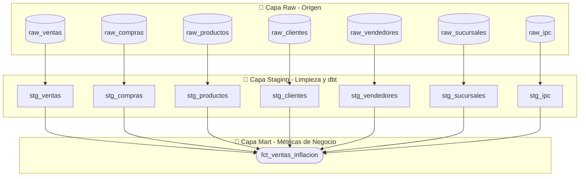

# 🚗 AutoAnalítica Pro: Plataforma Analítica y Agente Text-to-SQL Seguro

[](https://fastapi.tiangolo.com/)
[](https://reactjs.org/)
[](https://www.getdbt.com/)
[](https://www.sqlite.org/)
[](https://openai.com/)
[](https://vite.dev/)
AutoAnalítica Pro es una plataforma analítica end-to-end orientada a la venta minorista de repuestos y accesorios automotrices. Integra **Ingeniería de Datos moderna (dbt + SQLite)**, una **API REST (FastAPI)**, un **dashboard interactivo premium con interfaz Glassmorphic (React + Recharts)** y un **Agente Inteligente Text-to-SQL** diseñado bajo estrictos protocolos de seguridad para traducir lenguaje natural a consultas SQL sin riesgo de inyección o alteración de datos.

🔗 **Demo de la Aplicación Web:** [https://autoanalitica.lioneldiaz.com](https://autoanalitica.lioneldiaz.com)

---

## 📈 1. El Caso de Negocio: Erosión Inflacionaria de Márgenes

En entornos financieros volátiles (como la simulación de 2 años basada en el IPC real mensual de Argentina), las empresas minoristas sufren de **ilusión monetaria** al calcular sus ganancias:
1.  **Margen Nominal:** Es el cálculo tradicional de ganancia de venta ($$Precio\ de\ Venta - Costo\ Histórico\ de\ Adquisición$$). Muestra una rentabilidad ficticiamente alta.
2.  **Margen Real Ajustado:** Es la ganancia calculada descontando el **Costo de Reposición Real** (el precio de volver a adquirir la mercadería al momento de la venta).

Este proyecto cruza las transacciones de ventas con las compras a proveedores y la inflación oficial para calcular la **pérdida neta por inflación** y mostrar cómo un negocio aparentemente próspero puede estar operando con márgenes reales negativos.

---

## 🛠️ 2. Arquitectura de Datos (Capa Medallion)

El procesamiento y modelado de datos se estructura bajo el modelo Medallion utilizando **dbt Core**:



-   **Bronze (Raw):** Datos transaccionales simulados de ventas y compras cruzados con la inflación de la API del IPC argentino.
-   **Silver (Staging):** Limpieza, estandarización de tipos, tratamiento de nulos y casteo correcto de cadenas ISO en las fechas.
-   **Gold (Mart):** La tabla de hechos consolidada `fct_ventas_inflacion` computa el ajuste por inflación de forma indexada usando el IPC y determina los márgenes reales y nominales.

---

## 🔒 3. Seguridad del Agente Text-to-SQL

El agente utiliza **GPT-4o** de OpenAI como motor de lenguaje y cuenta con múltiples barreras de seguridad para evitar brechas o destrucción de datos:

1.  **Doble Motor de Base de Datos (Lectura Separada):** 
    El backend de FastAPI define dos conexiones independientes a `data.db`:
    *   **Motor Principal (Lectura-Escritura):** Exclusivo para almacenar las sesiones e historial de chat.
    *   **Motor Analítico (Estrictamente Sólo Lectura):** Conexión abierta con `?mode=ro`. Las consultas SQL generadas por el agente de IA se ejecutan a través de esta conexión, garantizando que el motor SQLite de la base de datos rechace cualquier escritura (`INSERT`, `UPDATE`, `DELETE`, `DROP`), independientemente del comportamiento del LLM.
2.  **Sanitización Lógica Anti-Inyección:**
    Antes de ejecutarse, el código SQL es procesado por un sanitizador de backend que:
    *   Elimina comentarios (`--` y `/* ... */`) y cadenas literales (`'...'`) para evitar eludir los filtros.
    *   Bloquea palabras clave prohibidas como `DROP`, `ALTER`, `TRUNCATE`, `GRANT`, entre otras.
    *   Invalida el chaining de sentencias con punto y coma (`;`), impidiendo la inyección secuencial.
3.  **Manejo de Falsos Positivos:** La sanitización no bloquea búsquedas legítimas que contengan nombres de productos con términos restringidos (como repuestos del tipo "replace" o "update") al filtrar las cadenas de texto del análisis.
4.  **Políticas del Prompt del LLM:** Se restringe la respuesta del modelo exclusivamente a consultas `SELECT` compatibles con SQLite, obligando al uso de `strftime` para fechas y funciones de ventana como `RANK()` en lugar de agregaciones anidadas prohibidas en SQLite.

---

## 📁 4. Estructura del Proyecto

```text
├── backend/                   # API REST en FastAPI
│   ├── app/                   # Código de la aplicación
│   │   ├── agent.py           # Agente LLM Text-to-SQL y sanitización
│   │   ├── database.py        # Configuración de base de datos (RW y RO engines)
│   │   └── main.py            # Endpoints de API y ruteo
│   ├── tests/                 # Pruebas unitarias de endpoints y agente
│   └── requirements.txt       # Dependencias de Python
├── frontend/                  # Interfaz de usuario (React + Vite)
│   ├── src/                   # Componentes, vistas y Recharts
│   │   ├── App.jsx            # Aplicación principal y chat
│   │   └── index.css          # Estilos Glassmorphism premium
│   └── package.json           # Dependencias de npm
├── data_pipeline/             # Pipeline primario de simulación
│   └── mock_data_generator.py # Ingesta sintética e integración de IPC
├── dbt_analytics/             # Proyecto de dbt Core
│   ├── models/                # Modelos de staging y marts
│   ├── tests/                 # Validaciones e integridad de datos
│   └── dbt_project.yml        # Configuración de dbt
├── bi_dashboard/              # Capturas y reportes de BI (.gitkeep)
├── .env.example               # Plantilla de variables de entorno
├── .gitignore                 # Archivos ignorados por Git
└── README.md                  # Documentación del repositorio
```

---

## ⚙️ 5. Configuración y Setup Local

Sigue estos pasos para correr la plataforma localmente:

### 1. Clonar el repositorio y configurar variables de entorno
Crea tu archivo `.env` en la raíz y en la carpeta `backend/` usando la plantilla:
```bash
cp .env.example backend/.env
```
Edita `backend/.env` y configura tus claves:
```env
OPENAI_API_KEY=tu_api_key_de_openai_aqui
DATABASE_URL=sqlite:///../data.db
```

### 2. Crear entorno virtual e instalar dependencias de Python
```bash
python -m venv .venv
source .venv/bin/activate  # En Windows usa: .venv\Scripts\activate
pip install -r backend/requirements.txt
```

### 3. Generar la base de datos y correr transformaciones de dbt
```bash
# Ingesta de datos crudos
python data_pipeline/mock_data_generator.py

# Transformaciones y tests de dbt
cd dbt_analytics
dbt run --profiles-dir .
dbt test --profiles-dir .
cd ..
```

### 4. Ejecutar el Backend (FastAPI)
```bash
cd backend
python -m pytest tests -v     # Valida que todos los tests pasen
uvicorn app.main:app --reload
# El backend correrá en http://localhost:8000
cd ..
```

### 5. Ejecutar el Frontend (React)
```bash
cd frontend
npm install
npm run dev
# La aplicación web estará lista en http://localhost:5173
```
